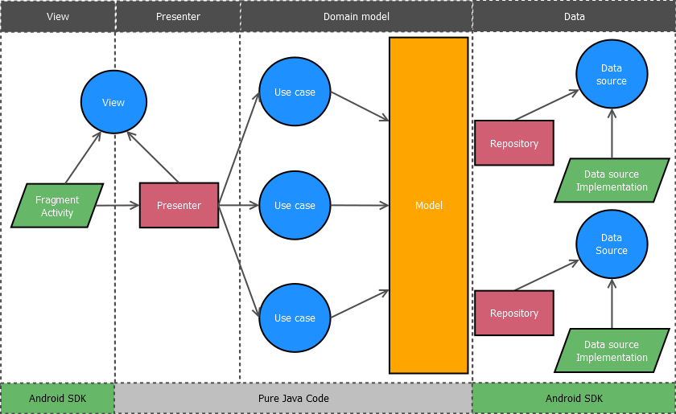

# Information

### THIS PROJECT IS STILL A WORK IN PROGRESS

This demo application is based on the [Clean Architecture](https://blog.8thlight.com/uncle-bob/2012/08/13/the-clean-architecture.html) principles and the [Model-View-Presenter](https://en.wikipedia.org/wiki/Model%E2%80%93view%E2%80%93presenter) (MVP) architecture.

## Libraries

The application uses the following libraries:

* [Dagger2](https://google.github.io/dagger/) for [dependency injection](https://en.wikipedia.org/wiki/Dependency_injection)
* [RxJava](https://github.com/ReactiveX/RxJava) to use [Reactive Extensions](http://reactivex.io)
* [Gradle Retrolambda Plugin](https://github.com/evant/gradle-retrolambda) to allow using Java 8 lambda expressions on Java 7
* [Map Struct](http://mapstruct.org/) to map between object models
* [Butter Knife](http://jakewharton.github.io/butterknife/) for view binding
* [Retrofit](http://square.github.io/retrofit/) for REST communication
* [Picasso](http://square.github.io/picasso/) for image downloading

# Testing

The application includes both **local unit tests** and **instrumented tests**.

* Local unit tests verifies presenters and domain objects (use cases), in both cases testing pure java code (nothing related with Android SDK).
* Instrumented tests modifies the injection graph to generate a mock API returning stub data and using different network behaviours. It test the whole application including all layers.

In order to run the instrumented tests, follow these steps (as described on [Espresso setup instructions](https://google.github.io/android-testing-support-library/docs/espresso/setup/index.html#setup-your-test-environment)):

* On your device, under Settings->Developer options disable the following 3 settings:
    * Window animation scale
    * Transition animation scale
    * Animator duration scale
